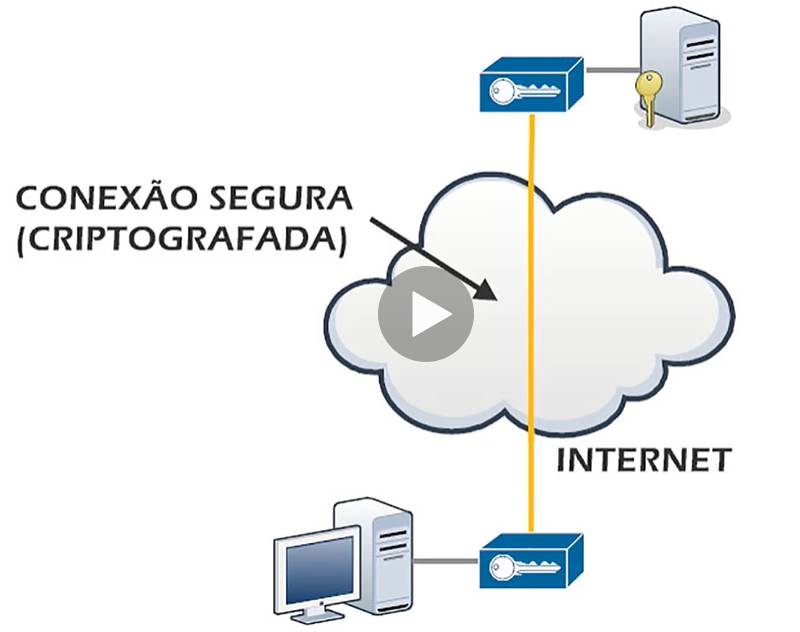

# Redes 

## VPN

Virtual Private Network (Rede privada virtual).

Exemplo prático para entender:

Vamos dizer que temos duas redes locais pertencentes a uma mesma empresa e queremos ligar essas duas redes, Se tiverem em uma predio ao lado do outro, isso é relativamente fácil. Mas vamos supor que estejam distante uma da outra, vamos dizer que a matriz da empresa esteja em São paulo e a filial em Manaus. 

A maneira antiga de se fazer isso é contratando uma empresa de telecomunicações de longa distância. Porém é um sistema extremamente caro, pois é uma conexão dedicada, só pra essa empresa.
Mas, é possível utilizar a internet pra fazer a conexão entre essas duas redes distantes baratiando muito esse custo. 

O problema de utilizar a internet é que ela é do tipo publica, todos os dados trafegados você não tem controle sobre eles, não tem controle por qual equipamento seus pacotes de dados vão passar e isso pode ser totalmente inseguro. Uma pessoa mal intensionada ou hacker pode ficar escutando e capturando os pacotes de dados abrindo e vendo o que está ali dentro. Assim entra a VPN.

VPN é fazer uma conexão de duas redes pertencente a mesma empresa ou individuo usando a internet, só que fazendo essa conexão criptografa. Toda a conexão será criptografada, então mesmo que um hacker pegue os pacotes de dados no meio do caminho e abra ele não conseguirá ler o que tá ali porque os dados estão criptografados.  

Exemplo: Um executivo que está em viagem ou trabalhando de home office e ele precisa acessar os arquivos, sistemas, recursos da empresa, com a VPN ele terá acesso a tudo isso como se estivesse na empresa.

VPN serve para acessar sites bloqueados? Isso é um conceito equivocado de VPN. Você pode juntar o conceito de Proxy com VPN (Proxy VPN). Pode fazer a conexão de proxy usando criptografia, assim melhorando um pouco mais a segurança fazendo a conexão do seu computador ao servidor de proxy utilizando uma conexão privada virtual, criptografada. Por isso a confusão.

VPN: Conexão criptografada entre duas redes usando internet.
Proxy VPN: Sistema de proxy usando VPN para mascarar a origem.

Exemplo mais comum: Quando a justiça determinou o blouqueio do WhatsApp.

Resumo:

Proxy:

1. Sistema de cache
2. Mascaramento da origem

VPN:

1. Conexão criptografada entre duas redes usando a internet.
2. Mascaramento da origem

* * * 
[Próxima página - Page 04](../Page%2004/readme.md)
