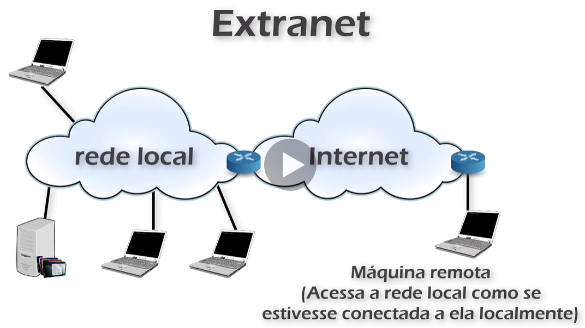

# Redes 

## Exercício

> Gabarito no final da página.

### **1. É uma caracteristica das redes Extranet prover a(o)**

1. Certificação digital de usuários que se conectam à internet.
2. conexão privada entre hosts utilizando um link de internet.
3. Tecnologia que permite utilizar cabos com medidas superiores a 300 m.
4. Acesso irrestrito a servidores de e-mail.
5. Compartilhamento público de informações na internet.
  

### **2. Acerca de infraestrutura de TI, julgue o item subsequente**

Uma empresa que precise interligar suas filiais, em Brasília e no
Rio de Janeiro, por meio de uma mesma rede de comunicação,
deverá implantar uma rede do tipo WAN, que disponibiliza
serviços de rede acessíveis de forma geograficamente
distribuída.

1. Certo
2. Errado

### **3. Julgue o item seguinte, acerca de tecnologias de redes locais**

As redes LANs (local area network) permitem o
compartilhamento de recursos e a troca de informações e
podem ser distinguidas de outros tipos de redes pelo seu
tamanho, por sua tecnologia de transmissão e por sua
topologia.

1. Certo
2. Errado

### **4. Com relação a redes de comunicação, julgue os itens a seguir.**

1. Uma LAN (local area network) é uma rede local de computadores que tem abrangência física de poucos quilômetros, alta taxa de transferência de dados, baixa ocorrência de erros e sempre apresenta roteamento da informação.
2. Uma MAN (metropolitan area network) é caracterizada por abranger uma região metropolitana de
determinada cidade.
3. Uma WAN (wide area network) é uma rede geograficamente distribuída que engloba uma vasta região (estado, país, ou até mesmo continente).
4. Em uma WAN, geralmente existe o roteamento da informação. Esse serviço é transparente para o usuário final, uma vez que é de responsabilidade de uma concessionária de telecomunicações, proprietária e operadora da WAN.

A quantidade de itens certos é igual a:

1. (0)
2. (1)
3. (2)
4. (3)
5. (4)

### **5. Sobre as principais características de um servidor Proxy Reverso, é INCORRETO afirmar que:**

1.  a criptografia SSL pode ser delegada ao próprio servidor Proxy
2.  o Proxy Reverso pode distribuir a carga para vários servidores, ficando cada servidor responsável por sua própria aplicação.
3. Dependendo da arquitetura da rede onde o servidor Proxy Reverso está instalado, o Proxy Reverso pode ter que modifica as URLs válidas externamente, para os endereços da rede interna.
4. Um Proxy Reverso pode aliviar a carga dos servidores Web através de um cache, tanto para conteúdo estático quanto dinâmico.
5. Um servidor Proxy não é capaz de otimizar e comprimir o
conteúdo tornando o acesso mais rápido.

### **6. Quanto aos conceitos do Proxy Reverso, analise as afirmativas abaixo expostas em um seminário de segurança. Dê valores Verdadeiro (V) ou Falso (F) e assinale a alternativa que apresenta a sequência correta (de cima para baixo):**

- [] Ele deve estar posicionado antes de um servidor Web, recebendo as requisições
externas.
- [] O proxy reverso pode distribuir a carga para vários servidores, balanceando a
carga.
- [] Ele não permite a possibilidade da otimização e compressão de conteúdo.

1. V - V - V
2. V - V - F
3. V - F - V
4. F - F - V
5. F - F - F

### **7. Os serviços de __________ permitem que os arquivos de um usuário sejam salvos remotamente, compartilhados com outras pessoas e acessados a partir de diferentes computadores.**

Qual termo/expressão preenche corretamente a lacuna da assertiva?

1. Navegação
2. Troca de mensagens
3. Pesquisa em páginas
4. Segurança da informação
5. Armazenamento de dados em nuvem

### **8. No que se refere ao acesso remoto e às topologias de redes de computadores, julgue o item que se segue.**

Para que um usuário tenha acesso a um dispositivo de rede por
meio de acesso remoto, é necessário que ele esteja na mesma
rede do dispositivo.

1. Certo
2. Errado

### **9. Qual das tecnologias abaixo permite que dois computadores utilizando uma rede pública possam se conectar de forma segura?**

1. VPP
2. VTN
3. NFC
4. VPN
5. NVP

### **10. Julgue o item que se segue, a respeito de arquitetura e tecnologias de sistemas de informação.**

Na arquitetura cliente-servidor, a característica transacional da comunicação entre cliente e servidor indica que o servidor deve enviar apenas conteúdo relevante em resposta ao pedido do
cliente.

1. Certo
2. Errado

## Gabarito

1. B
2. A
3. A
4. D
   1. I - Errado
   2. II - Certo
   3. III - Certo
   4. IV - Certo
5. E
6. B
7. E
8. B
9. D
10. A

* * * 
* [Página anterior - Page 03](../Page%2003/readme.md)
* [Próxima página - Page 05](../Page%2005/readme.md)
