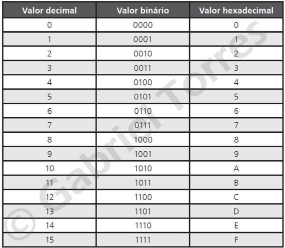

# Bases numéricas

    - Sistema decimal é representado pela base 10 e possui dígitos de 0 a 9
    - Sistema binário é representado pela baswe 2 e possuí digitos 0 e 1.
    - Já o sistema octal possui a base 8 e é representado por dígitos de 0 a 7.
    - Por último, o sistema hexadecimal é representado pela base 16. Seus dígitos são representados de 0 a 9, acrescidos de A, B, C, D, E e F.

Antes de mais nada precisamos lembrar de alguns conceitos básicos: BIT e sistemas numéricos.

**BIT**

* Vem do termo Binary Digit ou digito binário. Dígito binário é o menor elemento de informação que temos, representado sempre por 0 ou 1
* Quando usamos 4 bits, chamamos de nibble.
* Quando usamos um conjunto de 8 bits, chamamos de byte; logo, chamamos 16 bits de 2 bytes
Ou seja, de byte para bits multiplicamos o byte por 8. Ex: 6 byte é igual: 6 * 8 = 48 

**Sistema numérico decimal**

É o sistema mais conhecido por utilizarmos no dia a dia.

	- A base desse sistema é 10.
	- Símbolos:  de 0 a 9
	- Universal
	- Notação 195(10) (195 na base 10)
	- Vale lembrar a representação para se chegar a um número decimal

(4 x 10^2) + (9 x 10^1) + (3 x 10^0) = 400 + 90 + 3 = 493 493(10) (493 na base 10)

**Sistema numérico binário**

É usado na eletrônica digital e Álgebra Booleana.

	- A base desse sistema é 2
	- Símbolos: 0 e 1
	- Usado nos computadores
	- Notação: 11010110(2) (11010110 na base 2)

**Sistema numérico octal**

É um meio de diminuir grandes números binários

	- A base desse sistema é 8
	- Símbolos: de 0 até 7
	- Usada nos circuitos eletrônicos
	- Notação: 1574(8) (1574 na base 8)

**Sistema numérico hexadecimal**

É o sistema mais usado para diminuir grandes números binários e o mais utilizado.
A base desse sistema é 16

	- Símbolos desse sistema é 16
	- Símbolos: de 0 até 9 e de A até F
	- As letras possuem valores decimais:
    - A = 10
    - B = 11
    - C = 12
    - D = 13
    - E = 14 
    - F = 15
	- Utilizado na programação de microprocessadores.
Notação: C3B2(16) (C3B2 na base 16)

## Decimal

Exemplo: 4731

```
1 X 10^0 = 1
3 X 10^1 = 30
7 X 10^2 = 700
4 X 10^3 = 4000

Somando: 4731
```

## Binário

1100

```
0 X 2^0 = 0
0 X 2^1 = 0
1 X 2^2 = 4
1 X 2^3 = 8

Somando: 8 + 4 + 0 + 0 = 12
```

# Hexadecimal

0 1 2 3 4 5 6 7 8 9 A B C D E F

Tabela:
* * *

* * *

**Posiveis representações das base.**

Base 2: 10b = $10
Base 10: 10d = 10
Base 16 = 10h = 0x10

* * *
[Página anterior - Page 04](../Page%2004/readme.md)
[Próxima página - Page 06](../Page%2006/readme.md)
