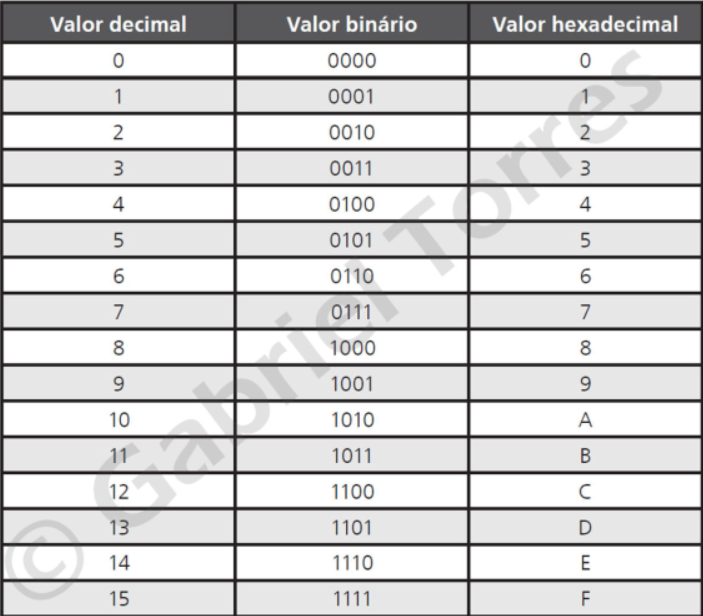

# Conversão de binário para hexadecimal

> Cada algarismo hexadecimal representa um número de quatro bits

> Com quatro bits podemos representar números de 0 a 15 (decimal) ou 0 a F (hexadecimal)
> **0000 a 1111**

**Exemplo:**
> É mais fácil escrever 3C27 do que **11110000100111**

# Convertendo de binário para hexadecimal

* * * *

* * * *

* * * * 
> Importante separar em blocos de 4 em 4 bits da direita para a esquerda. Caso falte número no último bloco para ficar 4 bits, completar com 0 a esquerda.

> Exemplo: 11101010010 

> Exemplo:  111|0101|0010
> Exemplo: 0111|0101|0010

#### Basta usar a tabela

* * *

* * *

> Caso não tenha a tabela, pode-se converter para decimal e depois para hexadecimal.

* * * *

* * * 
* [Página anterior - Page 06](../Page%2006/readme.md)
* [Próxima página - Page 08](../Page%2008/readme.md)
