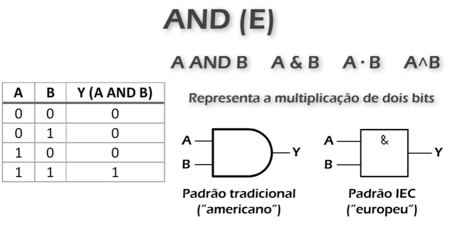
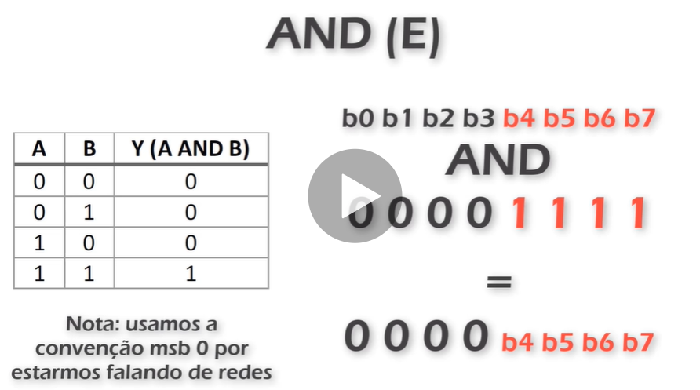
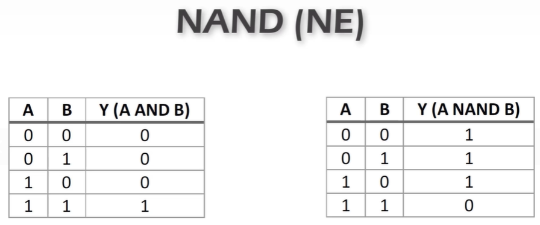

# Operações lógicas

* AND
* NAND
* OR
* NOR
* XOR
* XNOR
* NOT

## AND

Primeiro verificar se ambos os numeros tem a mesma quantidade de bit. Caso não tenha, completar com zero a esquerda. Comparar bit a bit

11000110 
and 
10100011
=
10000010

Em redes, a operação lógica AND pode ser usada para extrairmos bits de uma palavra binária, através de uma técnica chamada máscara.

Ex: temos uma palavra binária e queremos extrair os 4 bits menos significativos.

b0 b1 b2 b3 b4 b5 b5 b6 b7

Pratica real.
Extraindo os 4 bits menos significativos.
Técnica de mascara.
Coloca em 1 aqueles bits que queremos extrair. E os que não queremos, colocamos 0.

Tabela complementar. Invertido. NAND (NE)

* * * 
* [Página anterior - Page 10](../Page%2011/readme.md)
* [Próxima página - Page 12](../Page%20013/readme.md)
